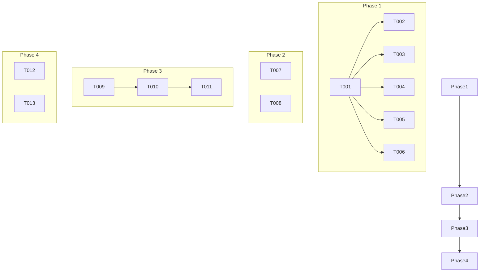

# Task Breakdown: Retrieval-Enabled Agent

**Branch**: `005-retrieval-agent` | **Date**: 2025-12-14 | **Plan**: [plan.md](./plan.md)

This document breaks down the implementation of the Retrieval-Enabled Agent into actionable, dependency-ordered tasks.

## Phase 1: Project Setup

These tasks prepare the project structure and environment.

- [x] T001 Create `backend/` and `tests/` directories if they don't exist.
- [x] T002 Create a `requirements.txt` file in the `backend/` directory with initial dependencies: `openai`, `qdrant-client`, `python-dotenv`.
- [x] T003 Create an empty `backend/agent.py` file.
- [x] T004 Create an empty `backend/main.py` file based on the quickstart guide.
- [x] T005 Create empty test files: `tests/unit/test_retrieval_tool.py` and `tests/integration/test_agent_qdrant.py`.
- [x] T006 Create a `.env` file in the root directory with placeholder values for `OPENAI_API_KEY`, `QDRANT_URL`, `QDRANT_API_KEY`, and `QDRANT_COLLECTION_NAME`. Add `.env` to `.gitignore`.

## Phase 2: Foundational (Red: Write Failing Tests)

This phase focuses on writing the tests that will fail until the implementation is complete.

- [x] T007 [P] In `tests/unit/test_retrieval_tool.py`, write a unit test that mocks the `qdrant-client` and verifies that the (not-yet-written) `retrieve_context` function in `backend/agent.py` correctly formats its output.
- [x] T008 [P] In `tests/integration/test_agent_qdrant.py`, write an integration test that calls the (not-yet-written) `ask_question` function and asserts that it receives a non-empty string as a response. This test will require a running Qdrant instance.

## Phase 3: User Story 1 (Green: Implement Core Logic)

Implement the core functionality described in the feature specification.

-   **Goal**: An AI developer can use the Agent SDK to ask a question and receive a grounded answer from Qdrant.
-   **Independent Test**: The integration test in `tests/integration/test_agent_qdrant.py` should pass.

- [x] T009 [US1] In `backend/agent.py`, implement the `retrieve_context` function. It should connect to Qdrant using environment variables and perform a similarity search.
- [x] T010 [US1] In `backend/agent.py`, implement the `ask_question` function. This function will initialize the OpenAI Agent, register `retrieve_context` as a tool, and manage the conversation flow to get an answer.
- [x] T011 [US1] In `backend/main.py`, implement the main execution block to call `ask_question` as described in the quickstart guide.

## Phase 4: Polish & Refinement

Finalize the feature with documentation and cleanup.

- [x] T012 Update `README.md` with instructions on how to set up and run the agent.
- [x] T013 Review and refactor `backend/agent.py` for clarity, error handling, and comments.

## Dependencies

## Parallel Execution

-   Tasks **T007** and **T008** can be worked on in parallel as they concern different test files.
-   Most implementation tasks within **Phase 3** are sequential.

## Implementation Strategy

The implementation will follow a Test-Driven Development (TDD) approach, where failing tests are written first (Phase 2) to clearly define the requirements for the implementation (Phase 3). This ensures that the agent is built to specification and is verifiable at each step. The MVP is the completion of Phase 3, which delivers the core user story.
