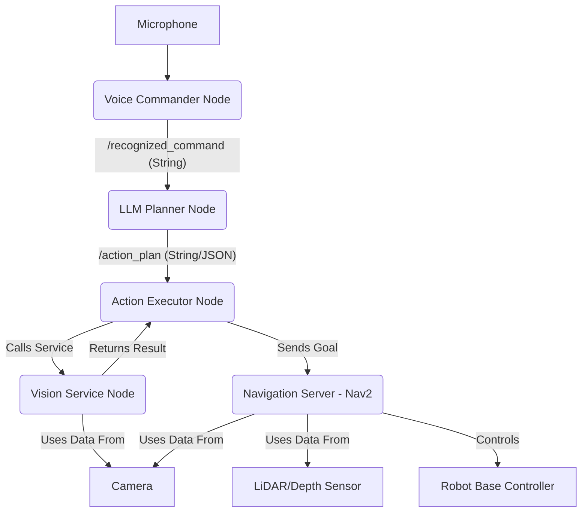

# Chapter 5.1: Project Overview and Setup

Welcome to the final module. Over the past four modules, we have explored the foundational technologies required to build an intelligent robot:
-   **Module 1**: ROS 2 for communication and basic structure.
-   **Module 2**: Gazebo for physics simulation and environment design.
-   **Module 3**: NVIDIA Isaac for accelerated perception and AI training.
-   **Module 4**: Vision-Language-Action (VLA) models for understanding and planning.

In this capstone project, we will integrate all of these pieces into a single, cohesive system. Our goal is to create a simulated robot that can respond to a natural language voice command, find a specific object in its environment, navigate to it, and signal its success.

## The Goal: "Fetch the Object"

The specific task for our capstone project is to have a robot successfully execute a command like:

> **"Robot, please find the red can on the table."**

To accomplish this, the robot must perform the full "sense-plan-act" loop we've been building towards:

1.  **Sense (Voice)**: Listen to the command using a microphone.
2.  **Plan (Language)**:
    -   Convert the voice to text (Whisper).
    -   Break down the text command into a sequence of executable steps (LLM).
3.  **Act & Sense (Vision)**:
    -   Navigate to the object's general location (e.g., 'the table').
    -   Visually search the area to find the specific object ('red can').
4.  **Act (Finalization)**:
    -   Move closer to the object.
    -   Announce that the object has been found.

Due to the complexity of real-world manipulation, this capstone will focus on the navigation and perception parts of the problem, culminating in the robot successfully identifying and reaching the object. The final `pick_up` action is left as an advanced extension for the reader.

## System Architecture

Our system will be composed of several ROS 2 nodes, each responsible for one part of the VLA pipeline.



1.  **Voice Commander Node**: Uses Whisper to convert speech to text and publishes it.
2.  **LLM Planner Node**: Subscribes to the text, queries an LLM to get a JSON plan, and publishes the plan.
3.  **Action Executor Node**: Subscribes to the plan and orchestrates the mission. It is the "main" loop of our application.
4.  **Vision Service Node**: A service that, when called, uses a VLM (like CLIP) to find an object described by text.
5.  **Navigation Stack (Nav2)**: The collection of nodes responsible for localization, mapping, and path planning.
6.  **Robot & Simulator**: The simulated robot (in Gazebo or Isaac Sim) with its sensor and control plugins.

## Project Setup and Prerequisites

Before we start building the nodes, ensure your environment is set up correctly.

### 1. ROS 2 Workspace

You should have a ROS 2 workspace created and built, as covered in Chapter 1.3.

```bash
mkdir -p ros2_ws/src
cd ros2_ws
colcon build
```

### 2. Python Packages

We will create a new ROS 2 package for our capstone project. Inside this package, you will need to install the necessary Python libraries.

```bash
# From within your ROS 2 package directory
python -m venv venv
source venv/bin/activate
pip install -U openai-whisper
pip install -U openai # Or other LLM libraries
pip install -U transformers torch torchvision torchaudio
pip install -U sounddevice
```
It is highly recommended to use a Python virtual environment (`venv`) to manage these dependencies without conflicting with system packages.

### 3. Simulation Environment

You need a working simulation environment with your robot model.
-   **Robot URDF**: A robot description file, as created in Chapter 1.2.
-   **Gazebo World**: An SDF world file containing your robot and some objects for it to find, as described in Chapter 2.2. The world should contain a 'table' and a 'red can' or similar objects.
-   **Sensors**: Your simulated robot must be equipped with:
    -   A camera.
    -   An IMU.
    -   A LiDAR or a depth camera for navigation.

### 4. ROS 2 Launch File

We will need a main launch file that starts all the necessary components:
-   The Gazebo simulation.
-   The `robot_state_publisher` for our robot's URDF.
-   The Nav2 stack.
-   All four of our custom capstone nodes (Voice Commander, LLM Planner, Action Executor, Vision Service).

Creating a robust launch file is a critical step and will be one of the first tasks in the next chapter. It ensures that our entire complex system can be brought up with a single command.

## Summary

The capstone project integrates every concept we've learned into a functional, intelligent system. By structuring our application as a series of communicating ROS 2 nodes, we create a modular and debuggable architecture. With the project goal and setup defined, the next chapter will dive into writing the code for the main orchestrator: the Action Execution Node.