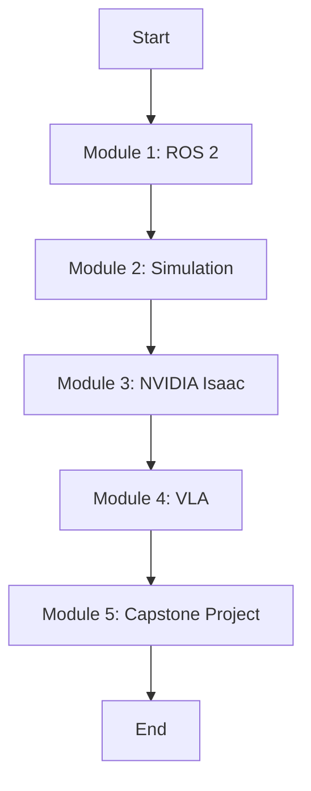

# Data Model: Book Structure

This document defines the data model for the "Physical AI & Humanoid Robotics" book. In this context, the "data model" refers to the hierarchical structure of the content.

## 1. High-Level Book Architecture

The book is structured as a collection of Modules, with each module containing multiple Chapters. The overall flow is designed to guide the reader from foundational knowledge to a complete, integrated capstone project.

## 2. Module & Chapter Structure

The book is composed of the following primary modules.

-   **Module 1: The Robotic Nervous System – ROS 2**
    -   Chapter 1.1: Introduction to ROS 2 Concepts (Nodes, Topics, Services, Actions)
    -   Chapter 1.2: Creating a Humanoid Description (URDF)
    -   Chapter 1.3: The Python Bridge: `rclpy` for AI Agents

-   **Module 2: The Digital Twin – Gazebo & Unity**
    -   Chapter 2.1: Fundamentals of Physics Simulation (Gravity, Collisions)
    -   Chapter 2.2: Designing a Digital Environment
    -   Chapter 2.3: Simulating Sensors (LiDAR, Camera, IMU)

-   **Module 3: The AI-Robot Brain – NVIDIA Isaac**
    -   Chapter 3.1: Photorealistic Training with Isaac Sim
    -   Chapter 3.2: Accelerated Perception with Isaac ROS
    -   Chapter 3.3: Navigation and Mapping (VSLAM, Nav2)
    -   Chapter 3.4: Introduction to Reinforcement Learning for Robotics

-   **Module 4: Vision-Language-Action (VLA)**
    -   Chapter 4.1: Voice to Text with Whisper
    -   Chapter 4.2: Planning and Reasoning with LLMs
    -   Chapter 4.3: Object Recognition with Vision Models
    -   Chapter 4.4: Executing Actions in ROS 2

-   **Module 5: Capstone – Autonomous Humanoid / Proxy Robot**
    -   Chapter 5.1: Project Overview and Setup
    -   Chapter 5.2: Integrating the Full Pipeline (Voice → Plan → Act)
    -   Chapter 5.3: Sim-to-Real Transfer and Deployment
    -   Chapter 5.4: Final Demonstration and Evaluation

## 3. Standard Chapter Section Structure

Each chapter within a module will consistently follow this internal structure to ensure a predictable and effective learning experience for the reader.

1.  **Overview**: A brief introduction to the chapter's topic and learning objectives.
2.  **Core Concepts**: Detailed explanation of the fundamental principles and theories.
3.  **Technical Explanation**: In-depth breakdown of the technology, architecture, and implementation details.
4.  **Hands-On Examples**: Practical, real-world code examples and walkthroughs that readers can replicate.
5.  **Future Trends**: A look at emerging research and future directions related to the topic.
6.  **Summary**: A concise review of the key takeaways from the chapter.
